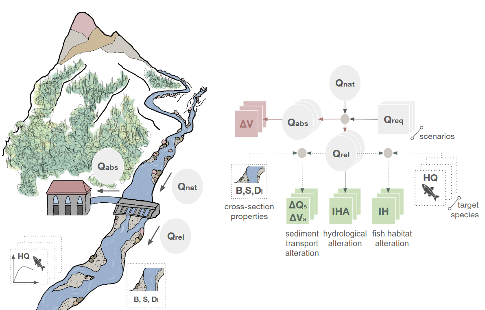

# SARAwater - Scenario-based Alteration of Rivers subject to water Abstraction

[](https://pypi.org/project/sarawater/)
[](https://doi.org/10.5281/zenodo.18183767)
[](https://opensource.org/licenses/MIT)

SARAwater helps quantify hydrological, habitat, and sediment-transport alterations in river reaches subject to water abstraction, allowing analysis under different water withdrawal scenarios.

## Key Features
* **Scenario-based Analysis:** Compare different water withdrawal scenarios, including fixed monthly minimum release rates and proportional release requirements based on the incoming flow.
* **Hydrological Alteration:** Evaluate changes in the hydrological regime under abstraction scenarios using the Index of Hydrological Alteration (IHA).
* **Habitat Assessment:** Quantify physical habitat suitability changes for aquatic species by means of the Mesohabitat approach.
* **Sediment Transport:** Analyze impacts on bedload transport in impacted river reaches using standard transport capacity relationships.

<p align="center">
  
</p>


## Quickstart

For a guided introduction and worked examples, start with the [documentation quickstart](https://sara-acqua.github.io/sarawater/quickstart.html) or browse the full documentation at [https://sara-acqua.github.io/sarawater/](https://sara-acqua.github.io/sarawater/).

## Installation

This package supports Python 3.11+ and can be installed with pip:

```bash
pip install sarawater
```

## Contributing & Bug Reports
* Found a bug or need a feature? [Open an issue](https://github.com/sara-acqua/sarawater/issues).
* Want to contribute code? Read our [Contributing Guidelines](https://github.com/sara-acqua/sarawater/blob/main/CONTRIBUTING.md).

## Citing

If you use SARAwater in your research, please cite the Zenodo release:

```bibtex
@software{Barile_2026_SARAwater,
  author       = {Barile, Gabriele and
                  Dal Santo, Matteo and
                  Crivellaro, Marta and
                  Zolezzi, Guido},
  title        = {{SARAwater: Scenario-based Alteration of Rivers subject to water Abstraction}},
  month        = jan,
  year         = 2026,
  publisher    = {Zenodo},
  doi          = {https://doi.org/10.5281/zenodo.18183767},
}
```
## License

This project is licensed under the [MIT License](https://opensource.org/licenses/MIT).